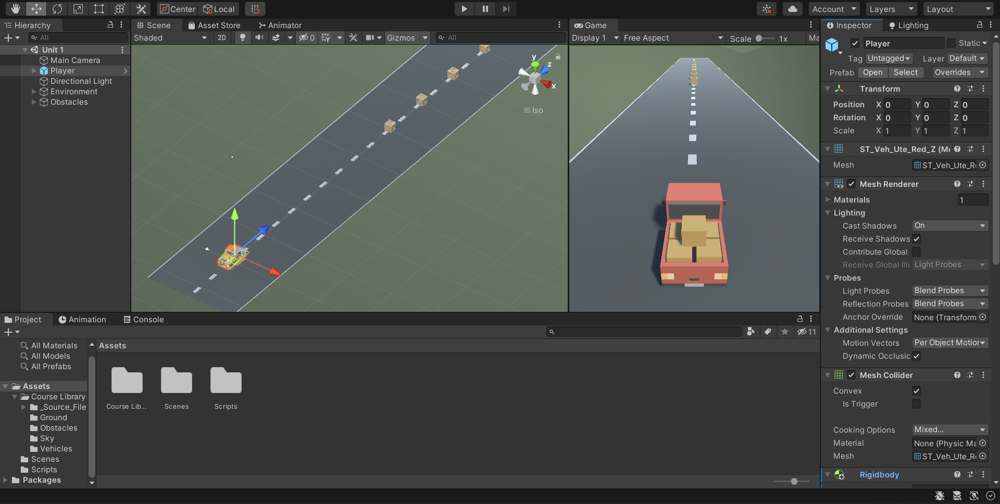
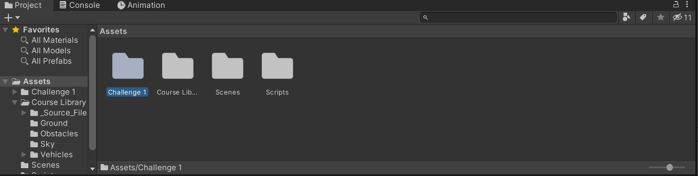
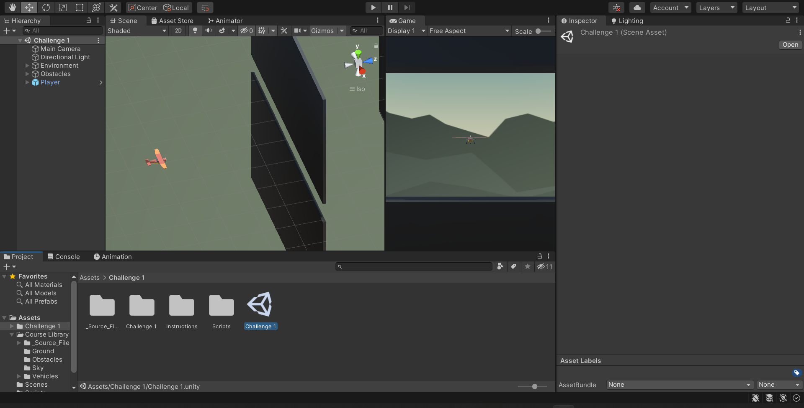
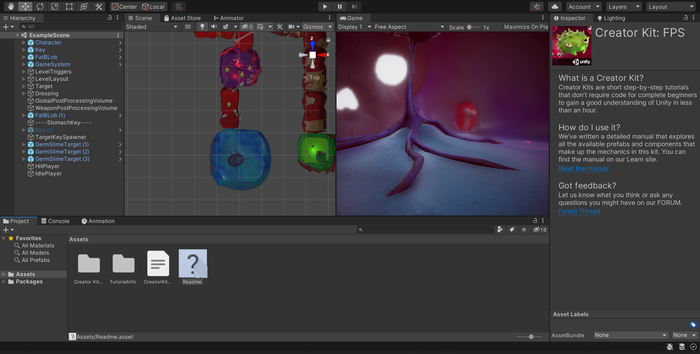

# Unity-Starter-Project
Welcome all. This is the Unity introduction for the CSU AR/VR Club. The purpose of this is to familarize you with Unity, the currently prefered VR/AR platform with native support for multiple headsets. Over the course of these you will become able to install Unity, add assets, manipulate enviroments, and - should you chosse to - script using C#. After learing these basics you will have the knowlege base and skills required to expand in Unity development. The last piece will be a guide on how to port your program to an Oculus and some basics for the tools that the Oculus library gives you on Unity.

We hope you enjoy and if you are finding this for the first time and are interested, Meetings are every Friday 5pm - 6pm in the CS Building room 130 or you can reach out to one of our officers here. //Hyperlink About Us

# Projects
Included in this repository are three project files organized by level of difficulty for every new members to try and dip their toe into Unity, or pique their personal interests. All you have to do is download the repository, as a zip file, from the green "Code" tab to have access to the Unity files
## Level 1: Introduction to the Unity UI and scripting (Unity version 2020.3.21f1 REQUIRE)
This is a beginning project for everyone who's new to Unity and would like to see what the game engine is like. The image below should be what you see.

- There are already premade assets, donwnloaded from the Unity asset store for player to grab and implement them in the world
- Scripting has already been done to control the car with collision mechanics
  - Player can drive the car into the boxes using WASD keys
## Level 2: Apply what you learned (Unity version 2020.3.21f1 REQUIRE)
This level will require you to apply what you've learned in the previous level to fix a level. Click on the "Challenge 1" folder then the "Challenge 1" UNITY file within that folder to open up the scene

- This project file will be the same as that from Level 1 but will have an additional file called "Challenge 1"
- "Challenge 1" will have a similar script and collision mechanic as the previous but its code is broken and wrong
  - This includes bad camera angle, poor movement and bad control
- Your job is to fix the flaws in the mechanics and control to get the level into a playable state
## Level 3: Unity challenge, create your own level (Unity version 2020.3.21f1 REQUIRE)
This last level repisotory is for those who would want to expand on what they know to create their own level in the FPS genre. Simply open the file in the "Unity hub" and you should see something similar to the image below.

- This project file is different from the first two in that it is a game geared toward the First Person Shooter genre
- All there is needed to do is for you to create your own level, add movement to the enemy and whatever you wish to create your own FPS level

# How to download Unity files
Press the downward arrow on the green "Code" button to pull up the tab with "Open with GitHub Desktop" and "Download ZIP"

Hit the "Download ZIP" button to download this repository and extract the ZIP file

If you have "Unity Hub" installed, it should look like this

Then follow the following steps to open the folder from "Unity Hub":
- Click the "Add" button
- Navigate to the folder which store the extracted ZIP file
- Click on the folder you want to open to highlight
- Press select folder

Otherwise you have Unity installed but not "Unity Hub", WITH THE CORRECT VERSION OF THE FLE
- Navigate to "Unity-Starter-Project > Level 1 - Beginner > Assets > Scenes"
- Click on "Unit 1.unity" to open the Unity file

